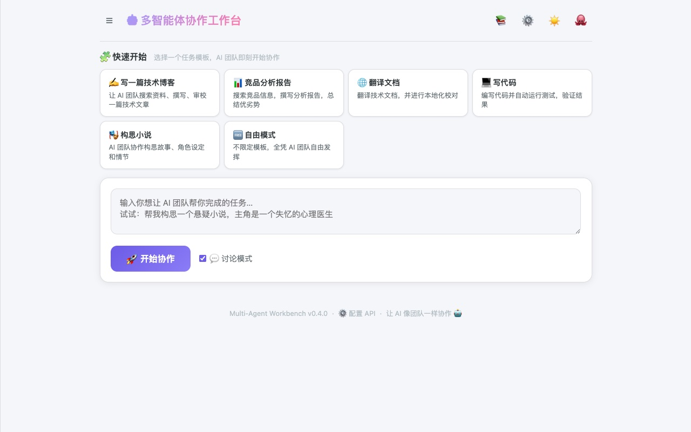
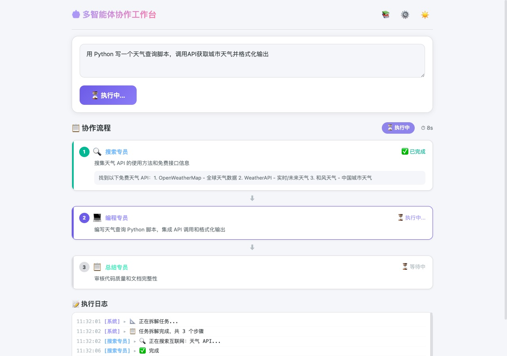
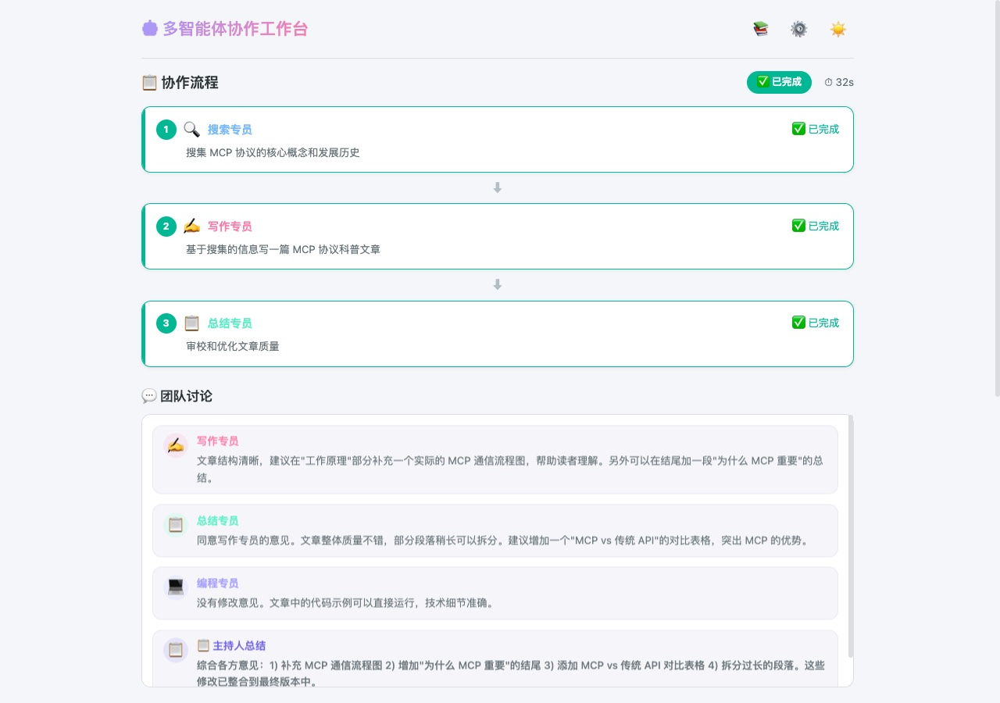

# 🤖 Multi-Agent Workbench

> ## 🚀 在线体验
> 
> **👉 [http://zybit.top/mawb/](http://zybit.top/mawb/)**
> 
> 无需安装，浏览器打开即用！已部署 7×24 小时在线服务。

**让多个 AI 像团队一样协作完成任务。**

<p align="center">
  
  
  
  
  
  
  
</p>

<p align="center">
  
  <br>
  <em>输入一个复杂任务，让 AI 团队帮你完成</em>
</p>

---

## ✨ 特性

- 🤖 **智能 Agent 团队** — 搜索、写作、编程、总结、讨论、翻译 + 自定义插件
- 🌐 **真实搜索引擎** — 搜索专员真实访问互联网搜资料（Bing + Wikipedia）
- 💻 **代码沙箱执行** — 编程专员的代码能**真实运行验证**，出错了自动修复
- 💬 **真正的多智能体讨论** — 每个 Agent 独立审阅成果并给出反馈，不是角色扮演
- 🧠 **记忆系统** — Agent 能记住历史对话和用户偏好，跨会话持续学习
- 🧩 **自定义 Agent 插件** — 在 Web 界面创建自己的 Agent，无需写代码
- 🛠️ **MCP 工具调用** — Agent 可动态调用 20 个工具（搜索/文件/Shell/代码/Git/数据处理）
- 📦 **知识库** — 上传文档（txt/md/csv/pdf），Agent 自动引用
- 🐳 **Docker 一键部署** — `docker compose up` 即刻运行
- 🧩 **任务模板** — 写博客、竞品分析、翻译文档等一键套用
- 📎 **对话上传文件** — 写任务时直接上传文档作为参考材料
- 📥 **多格式导出** — Markdown / HTML / PDF / DOCX / 纯文本
- 📝 **历史记录** — 保存完整协作过程（规划、中间结果、讨论），按时间排序
- 🧠 **记忆系统** — Agent 记住历史对话和用户偏好
- 🔌 **多模型支持** — DeepSeek / OpenAI / Claude / 通义千问 / Gemini / Kimi / 智谱 / Ollama
- ⚙️ **可视化配置** — 直接在 Web 界面切换模型和 Key，无需改文件、无需重启

## 🖥️ 界面预览

### 构思悬疑小说 🎭

提交一个复杂的创作任务，AI 团队分工协作：搜索专员从互联网搜集素材 → 写作专员创作大纲 → 总结专员审校质量，最后进入**真正的多 Agent 讨论阶段**，各专员从自己的专业角度独立反馈，互相审阅优化。

<p align="center">
  
  <br>
  <em>搜索专员已完成网络资料搜集，写作专员正在根据素材创作</em>
</p>

<p align="center">
  
  <br>
  <em>任务完成！各 Agent 独立审阅了成果。最终输出完整的三幕式悬疑小说大纲</em>
</p>

## 🚀 快速开始

### 方式一：Docker 一键启动（推荐）

```bash
git clone https://github.com/mianmian5/multi-agent-workbench.git
cd multi-agent-workbench
docker compose up -d
# 打开 http://localhost:8000
```
> 💡 首次使用：点击右上角 ⚙️ 配置 API Key → 选择任务模板 → 开始协作！

**更新到最新版：**
```bash
git pull
docker compose up -d --build
```

### 方式二：本地运行

```bash
git clone https://github.com/mianmian5/multi-agent-workbench.git
cd multi-agent-workbench
pip install -r requirements.txt

# Web 界面（推荐）
python -m multi_agent_workbench.web.app
# 打开 http://127.0.0.1:8000

# 命令行模式
python -m multi_agent_workbench.cli "帮我写一篇介绍多智能体系统的文章"
```

### 配置 API Key

点击右上角 ⚙️，在设置面板中填入 API Key、Base URL 和模型名称。**自动保存，即时生效**。

> 💡 支持**任何**兼容 OpenAI SDK 的 API（DeepSeek / OpenAI / 通义千问 / Claude / Gemini / Kimi / 智谱 / 本地 Ollama）。

## 🧠 记忆系统

Agent 拥有**长期记忆**，能在不同任务之间学习和回忆：

- **自动记忆** — 每次任务完成后，系统自动提取关键事实和对话摘要存入记忆
- **手动记忆** — 在 🧠 面板中添加事实、偏好或笔记
- **上下文感知** — 新任务开始时，Agent 自动搜索相关历史记忆并作为参考
- **持久化存储** — 记忆保存在 `~/.awb_memory/`，容器重启不会丢失

例如，你之前告诉过 Agent "偏好使用 DeepSeek 模型"，下次写代码任务时编程专员会自动记得。

## 📥 多格式导出

任务完成后，点击结果区域的 ⬇️ 按钮，选择导出格式：

| 格式 | 说明 |
|:--|:--|
| Markdown | 完整格式，带标题和元数据 |
| HTML | 可直接在浏览器打开的网页 |
| PDF | 浏览器打印生成，完整排版 |
| DOCX | 兼容 WPS/Word（macOS textutil 引擎） |
| 纯文本 | 轻量版本，适合复制粘贴 |

## 🏗️ 项目架构

```
multi-agent-workbench/
├── multi_agent_workbench/
│   ├── agent/                 # 🤖 Agent 定义
│   │   ├── base.py            #   基类 + LLM + 记忆 + MCP 工具调用
│   │   ├── search_agent.py    #   🔍 搜索专员（真实搜索）
│   │   ├── writer_agent.py    #   ✍️ 写作专员
│   │   ├── summarizer_agent.py#   📋 总结专员
│   │   ├── discuss_agent.py   #   💬 讨论专员（讨论主持人）
│   │   ├── coding_agent.py    #   💻 编程专员（含沙箱执行）
│   │   ├── translate_agent.py #   🌐 翻译专员
│   │   └── custom_agent.py    #   🧩 用户自定义 Agent
│   ├── tools/                 # 🛠️ 工具模块
│   │   ├── web_search.py      #   搜索引擎（Bing + Wikipedia）
│   │   ├── code_sandbox.py    #   代码安全执行沙箱
│   │   ├── knowledge_base.py  #   知识库管理系统
│   │   ├── mcp_tools.py       #   MCP 工具注册表（20个工具）
│   │   ├── custom_agent_registry.py # 自定义 Agent 管理
│   │   └── memory_system.py   #   🧠 记忆系统
│   ├── orchestrator/          # 🎯 核心调度
│   │   ├── planner.py         #   任务拆解器
│   │   ├── router.py          #   任务分配器
│   │   └── workbench.py       #   工作台主入口
│   ├── communication/         # 💬 Agent 间通信
│   │   └── message_bus.py     #   消息总线 + 工作日志
│   └── web/                   # 🌐 Web 界面
│       ├── app.py             #   FastAPI 服务
│       ├── templates/         #   页面模板
│       └── static/            #   样式和脚本
├── docs/images/               # 📸 截图
├── Dockerfile                 # 🐳 Docker 构建
├── docker-compose.yml         # 🐳 Docker Compose 配置
├── examples/
│   └── demo.py                # 演示脚本
├── .env.example               # 配置示例
├── requirements.txt
└── README.md
```

## 💬 真实的团队讨论

和市面上很多"角色扮演式讨论"不同，我们的 Agent 讨论是**真正的多智能体对话**：

```
✍️ [写作专员] 独立审阅视角:
   "文章结构流畅，建议在第三部分增加一个实际案例分析..."

💻 [编程专员] 独立审阅视角:
   "技术实现细节准确，代码示例可以直接运行..."

📋 [主持人总结]:
   "综合各位意见，建议：1) 更新数据来源 2) 增加案例 3) 代码示例完善"
```

每个 Agent 都是一个**独立的 LLM 调用**，从各自的专业角度给出真实反馈，而不是一个 LLM 在角色扮演多个角色。

## 🛠️ MCP 工具链（20 个工具）

Agent 在执行任务时可以**自主决定**调用哪些工具、调几次、如何组合。最多 5 轮工具调用循环。

| 类别 | 工具 | 说明 |
|:---|:---|:---|
| 🌐 **Web** | `web_search` | 搜索互联网（Bing+Wikipedia） |
| | `fetch_page` | 抓取网页正文 |
| | `check_url` | 检查 URL 可达性 |
| 📁 **文件系统** | `read_file` | 读取文件 |
| | `write_file` | 写入文件 |
| | `edit_file` | 编辑文件（文本替换） |
| | `list_files` | 列出目录 |
| | `grep_search` | 在文件中搜索文本 |
| 💻 **代码&Shell** | `run_code` | 沙箱执行 Python 代码 |
| | `run_shell` | 执行 Shell 命令 |
| | `git_status` | Git 仓库状态 |
| 📊 **数据处理** | `parse_json` | 解析/格式化 JSON |
| | `parse_csv` | 解析 CSV 为表格 |
| | `diff_text` | 文本差异对比 |
| | `count_tokens` | Token 数量估算 |
| | `hash_text` | 计算哈希值 |
| 🕐 **时间&信息** | `get_time` | 当前时间（多时区） |
| | `calculate` | 数学计算 |
| | `weather` | 天气查询 |
| | `url_analyze` | URL 结构分析 |

## 🧩 自定义 Agent

无需写代码，在 Web 界面创建你自己的 Agent：

1. 点击右上角 🧩 按钮
2. 填写名称、描述、能力关键词、系统提示词
3. 保存后自动生效，Planner 会自动识别并分配任务
4. 自定义 Agent 也参与团队讨论

## 📚 知识库

上传文档让 Agent 在协作时引用：

- **支持格式**：txt、md、csv、pdf
- **拖拽上传**：或点击选择文件
- **全文搜索**：Agent 自动搜索知识库相关内容
- **持久存储**：上传的文件不会随容器重启丢失

## 🧠 核心设计

### Agent 系统
每个 Agent 都是独立的执行单元，通过 `BaseAgent` 接口统一管理。支持动态加载自定义 Agent。

### 消息总线
Agent 之间通过 MessageBus 进行**异步通信**，支持点对点和广播，所有通信过程自动记录。

### 任务规划与路由
Planner 将复杂任务拆解为多个子任务，Router 根据子任务**类型自动分配**给最适合的 Agent（内置 6 个 + 任意自定义）。

### 记忆系统
每次任务完成后自动提取关键信息存入长期记忆，后续 Agent 执行任务时自动检索相关内容作为上下文。

## 🗺️ Roadmap

| 阶段 | 状态 | 说明 |
|:---:|:---:|:---|
| Phase 1 | ✅ | MVP — 三个 Agent 串行协作 |
| Phase 2 | ✅ | Web 可视化 + SSE 实时流 |
| Phase 3 | ✅ | 真实多智能体讨论（独立审阅） |
| Phase 4 | ✅ | 真实搜索引擎 + 代码沙箱 |
| Phase 5 | ✅ | 自定义 Agent 插件系统 |
| Phase 6 | ✅ | MCP 工具调用（20 个工具） |
| Phase 7 | ✅ | Docker 一键部署 |
| Phase 8 | ✅ | 多轮实时讨论 + 并行执行 |
| Phase 9 | ✅ | 记忆系统 + 多格式导出 |
| Phase 10 | 🔜 | 自定义工作流编排（拖拽编排 Agent 流程） |

## 📄 License

MIT
